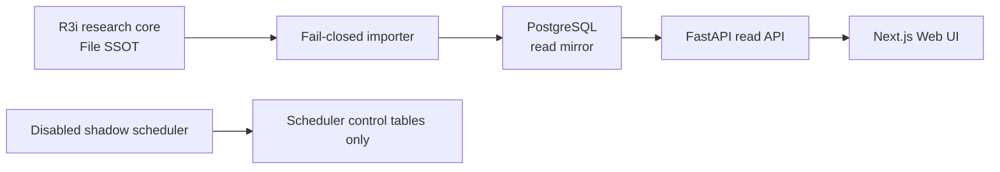

# 公主連結台服 AI 攻略研究所

Guide-Only Strategy Platform v3.0 的 B0 walking skeleton。這是一個可部署的
**本機／私人 staging**，不是公開正式版，也尚未宣稱 Gates D–G 通過。

目前端到端垂直切片以「紅焰深域 8-10」為例，提供三支實際通關隊伍、逐 Slot
條件、來源操作聲明、Evidence Drawer，以及誠實的結構化操作軸缺口。競技場在
尚無 exact verified counter 時只回傳空結果，不建立示意隊。

## 真相與安全邊界

- `research_core/pcr_tw_project/` 是唯一 canonical source；46 個 R3i 檔案受逐檔
  SHA-256 鎖定。
- PostgreSQL 只是可重建的 read mirror，不會回寫 research core。
- 台服是攻略主體；日服只作未來視與可轉用研究。中國服／B 服資料不作核心、
  替代或補洞依據。
- 不含帳號匯入、roster／owned、個人寶石或個人化推薦，也不登入或操作遊戲。
- Scheduler 預設停用且固定 Shadow Mode；B0 沒有 fetcher、publisher 或 canonical
  writer。
- Migration、Importer、API、Scheduler 使用分離的 PostgreSQL roles；API 只有
  serving tables 的 `SELECT` 權限。



## 快速驗證

需要 Python 3.13.14、Node.js 24 LTS／npm 11，以及 Docker Compose v2。

```powershell
python scripts/check_research_baseline.py
python -m pytest -q
npm ci
npm run check:contract
npm run typecheck
npm run build:web
```

研究核心的原始五命令需在 `research_core/pcr_tw_project/` 執行：

```powershell
python tools/validate_project.py --mode PRE_SUITE --write
python tools/validate_project.py --mode PRE_SUITE
python tools/validate_project.py --mode OPERATIONAL
python tools/validate_project.py --mode ARTIFACT_READY
python tools/mutation_test.py
```

目前預期 ARTIFACT_READY 仍以 exit 1 誠實揭露 Gate A／B／C 三項缺口；B0 不會為了
讓測試變綠而降低研究 Gate。

## 啟動本機私人堆疊

先將 `.env.example` 複製為 Git 忽略的 `.env`，並把四組密碼替換為彼此不同、至少
16 字元的 URL-safe 值：

```powershell
docker compose --env-file .env -f infra/compose.yml config --quiet
docker compose --env-file .env -f infra/compose.yml up --build --wait
```

服務入口：

- Web：<http://127.0.0.1:3000>
- API 文件：<http://127.0.0.1:8000/docs>
- API readiness：<http://127.0.0.1:8000/health/ready>
- Scheduler health：<http://127.0.0.1:8081/health>

完整的權限實測、scheduler smoke、備份還原與回滾流程請依
[`docs/operations/B0_RUNBOOK.md`](docs/operations/B0_RUNBOOK.md)；架構決策與後續
依賴順序見 [`docs/architecture/INTEGRATED_ROADMAP.md`](docs/architecture/INTEGRATED_ROADMAP.md)。
