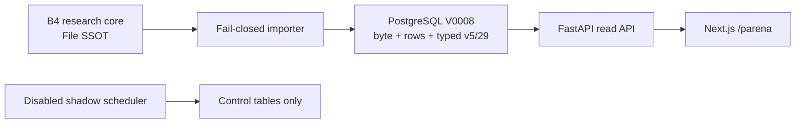

# 公主連結台服 AI 攻略研究所

Guide-Only Strategy Platform v3.0 的 RP-B4-0 Princess Arena Planner typed structural
closure candidate，建立在 immutable `rp-a6-0` Gate-correctness checkpoint、RP-B5-1 Gacha、
RP-A5 Arena、RP-A4 Water與B1 full-core round-trip之上。這是可部署的**本機／私人 staging**，
不是公開正式版。

RP-B4-0目前仍是candidate：code candidate
[`6102cfc0`](https://github.com/PXShou329/PCR_TW_Project/commit/6102cfc0e01d1d2f5f7653249d9976c57f76205f)
已在[OPEN/DRAFT PR #10](https://github.com/PXShou329/PCR_TW_Project/pull/10)完成第一輪
[private CI 31351894593](https://github.com/PXShou329/PCR_TW_Project/actions/runs/31351894593)
（completed/success，26m08s）。Final evidence commit、第二輪private CI、annotated
`rp-b4-0`與tag CI仍為`PENDING`。Data Gates A／B／C、Application Gate E、Automation F、
Production G均為`NOT PASS`；Application Gate D為`BLOCKED_BY_DATA_GATES`。

## Current B4 slice

- Research core由`scripts/research_core_rp_b4_0_manifest.sha256`鎖定：48 files、13 CSV、
  376 rows、Evidence→Claim 120 edges、Claim→Evidence 298 edges。
- Alembic head是`v0008_parena_planner_slice`；materialization v5共有29張typed serving
  tables。B4新增`arena_source_records`與五張`parena_case_*` tables。
- `GET /api/v1/parena/environments`、`POST /api/v1/solver/parena`與`/parena`形成
  source→DB→API→typed client→UI結構化垂直切片。
- Canonical `47_PRINCESS_ARENA_CASE_REGISTRY.csv`仍是0 rows／0 mature cases。合法查詢
  誠實回傳`NO_MATURE_PARENA_CASE`；沒有Similar fallback、理論隊或示意隊。
- `/pvp`維持五角色exact query；`/gacha`維持5筆timeline與4筆community source；紅焰／
  蒼波深域8-10各有五隊成熟PVE切片。

這輪證明未來成熟P-Arena case可以安全服務化，不代表P-Arena內容Gate已完成。成熟規則、
zero-case語意與V0008 rollback ownership見
[`ADR-0007`](docs/architecture/ADR-0007-parena-planner-typed-closure.md)。

## 真相與安全邊界

- `research_core/pcr_tw_project/`是唯一canonical source；PostgreSQL只保存byte mirror、
  lossless rows與typed serving closure，不回寫research core。
- 台服是攻略主體；JP只作未來視與可轉用研究。中國服／B服資料不作核心、替代或補洞依據。
- 中文角色名只用台服官方譯名；台服未實裝日角保留日文官方名，不自行翻譯。
- 不含Account Layer、MAIN／ALT、roster／owned、個人寶石或帳號專屬推薦，也不登入或操作遊戲。
- Scheduler固定disabled Shadow Mode：`SCHEDULER_ENABLED=false`、`SHADOW_MODE=true`、
  `AUTO_PUBLISH=false`。
- Migration、Importer、API、Scheduler使用分離PostgreSQL roles；API只擁有29張serving
  tables的`SELECT`。



## 快速驗證

需要Python 3.13.14、Node.js 24 LTS／npm 11與Docker Compose v2。

```powershell
python scripts/check_research_baseline.py
python scripts/check_application_data_parity.py --run-round-trip
python -m pytest tests apps/scheduler/tests
npm ci
npm run check:contract
npm run typecheck
npm run build:web
```

研究baseline wrapper必須在disposable copy實際執行五命令；ARTIFACT_READY預期仍以exit 1
揭露且只有Gate A／B／C三項FAIL，Mutation必須`ALL_OK / active_scenarios=122`。預期值不能
替代實際stdout。

RP-B4-0 local/private instance已在Compose project `pcr-tw-b4-parena`完成health、
`DB_PRIVILEGES_OK 777/26/12`、verified backup/restore、V0008 active-v5 downgrade guard、
B4→A6→B4第三輪演練與real E2E `28/28`。前兩輪分別在physical V7 missing-table與A6 public
baseline 19/25 shape邊界fail closed，且都先安全恢復exact B4才修正重跑；完整chronology與
retained backup見
[`B4_0_VERIFICATION_REPORT.md`](docs/operations/B4_0_VERIFICATION_REPORT.md)。精確操作順序與
失敗復原邊界見[`B4_ROLLBACK_RUNBOOK.md`](docs/operations/B4_ROLLBACK_RUNBOOK.md)。Final
local regression亦已通過：Python `404/404`、operations `97/97`、research baseline
`166/0/22 → 165/0/21 → 168/3/21`（ARTIFACT_READY只有A/B/C）、Mutation 122、contract
schemas 34、typecheck/build PASS、full mock `30/30`。Code candidate、Draft PR與第一輪CI已
實錄；final evidence commit、第二輪CI與`rp-b4-0` tag仍為`PENDING`。CI instance的backup、
rollback epochs與history digest不覆寫上述local evidence。

## 啟動本機私人堆疊

將`.env.example`複製為Git忽略的`.env`，並把owner、API、Importer與Scheduler密碼設為彼此
不同、至少16字元的URL-safe值：

```powershell
docker compose --env-file .env -f infra/compose.yml config --quiet
docker compose --env-file .env -f infra/compose.yml up --build --wait
```

- Web：<http://127.0.0.1:3000>
- API docs：<http://127.0.0.1:8000/docs>
- API readiness：<http://127.0.0.1:8000/health/ready>
- Scheduler health：<http://127.0.0.1:8081/health>

Verification services會改動control rows、typed rows、cache epoch與revision history，必須依
[`infra/README.md`](infra/README.md)的固定串行順序執行，不得profile-wide併發`up`。

## Immutable history

歷史文件與scripts不因B4更新而改寫：

- RP-A6-0：[`A6_0_VERIFICATION_REPORT.md`](docs/operations/A6_0_VERIFICATION_REPORT.md)、
  [`A6_ROLLBACK_RUNBOOK.md`](docs/operations/A6_ROLLBACK_RUNBOOK.md)
- RP-B5-1：[`B5_1_VERIFICATION_REPORT.md`](docs/operations/B5_1_VERIFICATION_REPORT.md)、
  [`B5_ROLLBACK_RUNBOOK.md`](docs/operations/B5_ROLLBACK_RUNBOOK.md)
- 更早A5／A4／B1 checkpoints仍保留其manifest、reports、runbooks與immutable tags。

目前B4的回滾target是immutable `rp-a6-0`；B4與A6跨越V0008／V0007 schema boundary，不能
套用歷史A6→B5 same-schema流程，也不能只checkout舊tag。整合依賴與未完成項見
[`INTEGRATED_ROADMAP.md`](docs/architecture/INTEGRATED_ROADMAP.md)。
