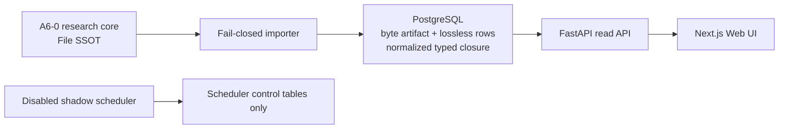

# 公主連結台服 AI 攻略研究所

Guide-Only Strategy Platform v3.0 的 RP-A6-0 Princess Arena Gate-correctness 候選，建立在
RP-B5-1 Gacha 垂直切片、B3／D0 exact picker、RP-A5 Arena typed slice、RP-A4 Water 成熟
切片與 B1 full-core round-trip 里程碑之上。這是一個可部署的**本機／私人 staging**，不是
公開正式版；Data／Application／Automation／Production Gates A–G 均未宣稱通過。

前一個 immutable 回滾點是私人 tag `rp-b5-1`；`rp-a5-2`、`rp-b3-d0-1` 與更早 checkpoints
繼續保留，不覆寫歷史 manifest 或移動既有 tags。RP-A6-0 完成私人 CI 後才建立新的
annotated `rp-a6-0` tag；目前仍是 release candidate，不能先宣稱 tag 或 CI 已完成。

目前端到端垂直切片包含「紅焰深域 8-10」與「蒼波深域 8-10」，各提供五支不同五人的實際通關隊伍、逐 Slot
條件、來源分離的操作軸、逐步 Evidence Drawer，以及誠實的 `UNKNOWN`／結構化操作軸缺口。競技場
research core 已加入同環境、實際勝利截圖支持的兩筆 `SINGLE_REPORT` exact counter；不把單次
回報包裝成勝率，也不建立示意隊。`/pvp` 現在以五個 AVAILABLE 台服官方名稱角色建立
可分享的 exact query；不足五人、重複角色與四人重疊都 fail closed，Similar 仍未啟用。
`/gacha` 把 5 筆 timeline 與 4 筆社群來源從 file SSOT 正規化到 PostgreSQL v4、FastAPI、
typed client 與 Next.js UI：2 筆 MATURE、3 筆 RESEARCH；三筆已知限定身分都有指定 JP
OFFICIAL／A Claim/Evidence，Vampy／Tia 維持 `UNKNOWN/null`。頁面不輸出個人寶石、
持有角色條件或帳號專屬抽取建議。

RP-A6-0 把 Princess Arena 47 Registry 從 20 欄擴成 24 欄，加入三個隊位 result Claims 與
完整三戰 WIN Claim，並以同環境 exact 39 closure、敵我各 15 人不重複、TW AVAILABLE、
source hostname／日期與 confidence 規則 fail closed。這輪只修 Gate correctness：47 仍是
0 rows／0 mature cases，尚無 P-Arena typed DB／API／UI／Planner，也沒有新增 V0008。

## 真相與安全邊界

- `research_core/pcr_tw_project/` 是唯一 canonical source；目前 RP-A6-0 的 48 個檔案
  由 `scripts/research_core_rp_a6_0_manifest.sha256` 逐檔 SHA-256 鎖定；RP-B5-1／RP-A5／
  RP-A4／RP-A3／RP-A2 manifests 保留供 immutable rollback 相容驗證。
- PostgreSQL 同時保存 byte-preserved artifact mirror、lossless row mirror 與 normalized typed
  serving closure；只有 typed closure 供 API／UI 讀取，三者都不會回寫 research core。
- 台服是攻略主體；日服只作未來視與可轉用研究。中國服／B 服資料不作核心、
  替代或補洞依據。
- 不含帳號匯入、roster／owned、個人寶石或個人化推薦，也不登入或操作遊戲。
- Scheduler 預設停用且固定 Shadow Mode；目前 RP-A6-0 仍沒有 fetcher、publisher 或
  canonical writer。
- Migration、Importer、API、Scheduler 使用分離的 PostgreSQL roles；API 只有
  serving tables 的 `SELECT` 權限。



## 快速驗證

需要 Python 3.13.14、Node.js 24 LTS／npm 11，以及 Docker Compose v2。

```powershell
python scripts/check_research_baseline.py
python scripts/check_application_data_parity.py --run-round-trip
python -m pytest -q
npm ci
npm run check:contract
npm run typecheck
npm run build:web
```

研究核心的原始五命令需在 `research_core/pcr_tw_project/` 執行：

```powershell
python tools/validate_project.py --mode PRE_SUITE --write
python tools/validate_project.py --mode PRE_SUITE
python tools/validate_project.py --mode OPERATIONAL
python tools/validate_project.py --mode ARTIFACT_READY
python tools/mutation_test.py
```

目前預期 ARTIFACT_READY 仍以 exit 1 誠實揭露 Gate A／B／C 三項缺口；本里程碑不會為了
讓測試變綠而降低研究 Gate。

目前 RP-A6-0 research-core 五命令由 `scripts/check_research_baseline.py` 在乾淨暫存副本
重現；166／166／165／168 checks、Mutation 122、fresh V0007 stack、651 格 ACL、Shadow
scheduler、backup／restore、A6→B5→A6 same-schema rollback 與 mock／real desktop/mobile
實跑輸出見
[`docs/operations/A6_0_VERIFICATION_REPORT.md`](docs/operations/A6_0_VERIFICATION_REPORT.md)；
操作順序與 fail-closed recovery boundary 見
[`docs/operations/A6_ROLLBACK_RUNBOOK.md`](docs/operations/A6_ROLLBACK_RUNBOOK.md)。歷史
RP-B5-1 證據仍見
[`docs/operations/B5_1_VERIFICATION_REPORT.md`](docs/operations/B5_1_VERIFICATION_REPORT.md)，
B5→A5→B5 schema rollback 仍依
[`docs/operations/B5_ROLLBACK_RUNBOOK.md`](docs/operations/B5_ROLLBACK_RUNBOOK.md)。歷史
A5→A4→A5 證據仍見
[`docs/operations/A5_VERIFICATION_REPORT.md`](docs/operations/A5_VERIFICATION_REPORT.md)。
本次 B3／D0 picker、metadata、重建 A5 stack、backup／restore 與 rollback 實跑輸出見
[`docs/operations/B3_D0_VERIFICATION_REPORT.md`](docs/operations/B3_D0_VERIFICATION_REPORT.md)。
RP-A4 的 round-trip、PostgreSQL、瀏覽器、E2E、restore 與 A4→A3 rollback drill 歷史輸出仍見
[`docs/operations/A4_VERIFICATION_REPORT.md`](docs/operations/A4_VERIFICATION_REPORT.md)；
B1 的歷史基線仍保留於
[`docs/operations/B1_VERIFICATION_REPORT.md`](docs/operations/B1_VERIFICATION_REPORT.md)。

## 啟動本機私人堆疊

先將 `.env.example` 複製為 Git 忽略的 `.env`，並把四組密碼替換為彼此不同、至少
16 字元的 URL-safe 值：

```powershell
docker compose --env-file .env -f infra/compose.yml config --quiet
docker compose --env-file .env -f infra/compose.yml up --build --wait
```

服務入口：

- Web：<http://127.0.0.1:3000>
- API 文件：<http://127.0.0.1:8000/docs>
- API readiness：<http://127.0.0.1:8000/health/ready>
- Scheduler health：<http://127.0.0.1:8081/health>

目前 A6 的權限、串行 verifier、backup／restore 與 A6→B5→A6 流程請依
[`docs/operations/A6_ROLLBACK_RUNBOOK.md`](docs/operations/A6_ROLLBACK_RUNBOOK.md)；
完整 B1 round-trip 基礎仍見
[`docs/operations/B1_RUNBOOK.md`](docs/operations/B1_RUNBOOK.md)；A4→A3 的版本回退與
重新前進請依 [`docs/operations/A4_ROLLBACK_RUNBOOK.md`](docs/operations/A4_ROLLBACK_RUNBOOK.md)；
A5→A4 的 backup-first 回退與重新前進請依
[`docs/operations/A5_ROLLBACK_RUNBOOK.md`](docs/operations/A5_ROLLBACK_RUNBOOK.md)；B5→A5
的 V0007／V0006 回退與重新前進請依
[`docs/operations/B5_ROLLBACK_RUNBOOK.md`](docs/operations/B5_ROLLBACK_RUNBOOK.md)。
架構決策與後續依賴順序見
[`docs/architecture/INTEGRATED_ROADMAP.md`](docs/architecture/INTEGRATED_ROADMAP.md)。
